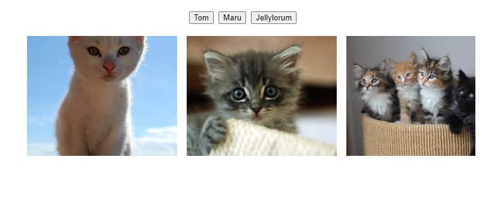

# How to manage a list of refs using a ref callback

#### wouldn’t work:

```js
<ul>
  {items.map((item) => {
    // Doesn't work!
    const ref = useRef(null);
    return <li ref={ref} />;
  })}
</ul>
```

## Code :

```js
import { useRef } from "react";

export default function CatFriends() {
  const itemsRef = useRef(null);

  function scrollToId(itemId) {
    const map = getMap();
    const node = map.get(itemId);
    node.scrollIntoView({
      behavior: "smooth",
      block: "nearest",
      inline: "center",
    });
  }

  function getMap() {
    if (!itemsRef.current) {
      // Initialize the Map on first usage.
      itemsRef.current = new Map();
    }
    return itemsRef.current;
  }

  return (
    <>
      <nav>
        <button onClick={() => scrollToId(0)}>Tom</button>
        <button onClick={() => scrollToId(5)}>Maru</button>
        <button onClick={() => scrollToId(9)}>Jellylorum</button>
      </nav>
      <div>
        <ul>
          {catList.map((cat) => (
            <li
              key={cat.id}
              ref={(node) => {
                const map = getMap();
                if (node) {
                  map.set(cat.id, node);
                } else {
                  map.delete(cat.id);
                }
              }}
            >
              
            </li>
          ))}
        </ul>
      </div>
    </>
  );
}

const catList = [];
for (let i = 0; i < 10; i++) {
  catList.push({
    id: i,
    imageUrl: "https://placekitten.com/250/200?image=" + i,
  });
}
```


