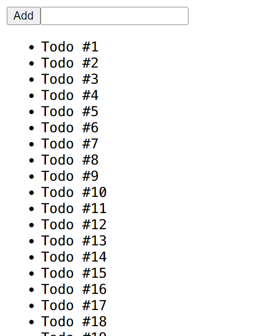

# Flushing state updates synchronously with flushSync (useRef)

```js
import { useState, useRef } from "react";
import { flushSync } from "react-dom";

export default function TodoList() {
  const listRef = useRef(null);
  const [text, setText] = useState("");
  const [todos, setTodos] = useState(initialTodos);

  function handleAdd() {
    const newTodo = { id: nextId++, text: text };
    flushSync(() => {
      setText("");
      setTodos([...todos, newTodo]);
    });
    listRef.current.lastChild.scrollIntoView({
      behavior: "smooth",
      block: "nearest",
    });
  }

  return (
    <>
      <button onClick={handleAdd}>Add</button>
      <input value={text} onChange={(e) => setText(e.target.value)} />
      <ul ref={listRef}>
        {todos.map((todo) => (
          <li key={todo.id}>{todo.text}</li>
        ))}
      </ul>
    </>
  );
}

let nextId = 0;
let initialTodos = [];
for (let i = 0; i < 20; i++) {
  initialTodos.push({
    id: nextId++,
    text: "Todo #" + (i + 1),
  });
}
```


